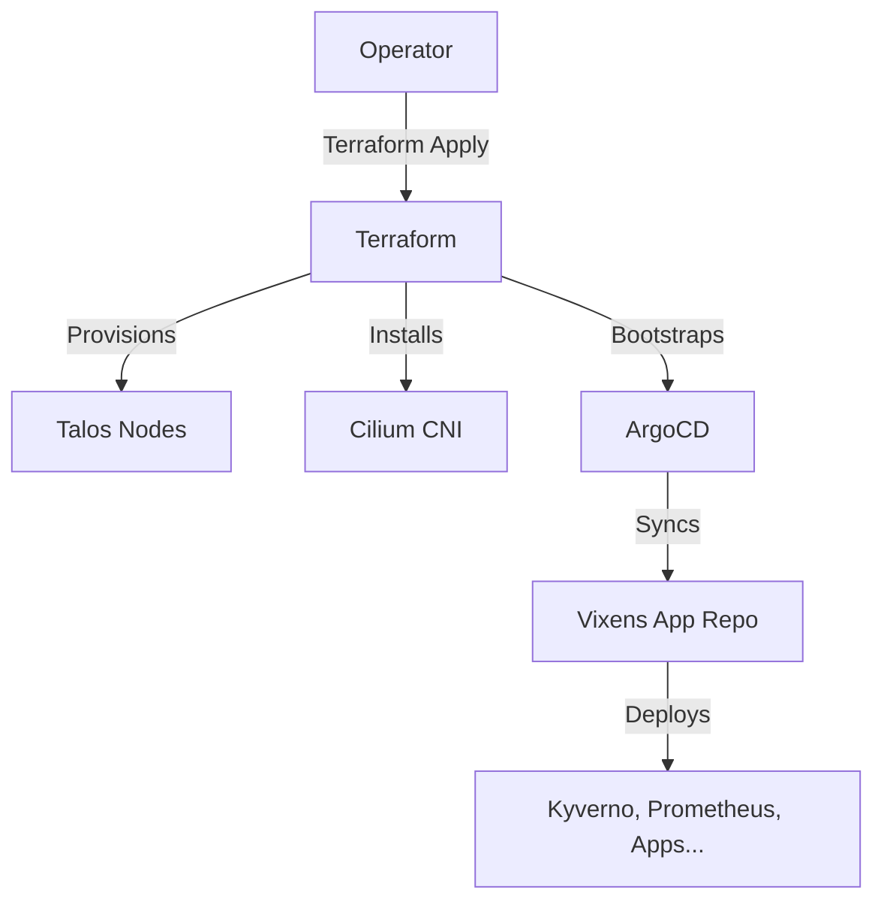

# TerraVixens Brownfield Architecture (Refined Scope)

**Date:** 2026-01-23
**Architect:** Winston
**Status:** Approved (Scope Refined)

## 1. Introduction

This document outlines the architectural boundaries and improvement strategy for **TerraVixens**. The primary goal of TerraVixens is to serve as the **Infrastructure Bootstrapper**: provisioning a healthy, secure, and functional Talos Linux cluster with Cilium CNI and ArgoCD, ready to hand off control to the downstream applications repository (`vixens`).

**Scope Definition:**
*   **IN SCOPE:** Terraform Lifecycle (Nodes, OS Upgrades), Talos Configuration, Cilium CNI (Connectivity), ArgoCD (Bootstrap), Storage Class Prerequisites (CSI).
*   **OUT OF SCOPE:** Application Observability (Prometheus/Loki), Policy Enforcement (Kyverno), Application-Level Network Policies. These are managed by the `vixens` repository via ArgoCD.

### Existing Project Analysis
*   **Primary Purpose:** Automated lifecycle management of bare-metal Talos clusters.
*   **Current Tech Stack:**
    *   **OS:** Talos Linux v1.11.0.
    *   **CNI:** Cilium v1.18.3 (L2 Announcements).
    *   **GitOps:** ArgoCD v7.7.7 (App-of-Apps bootstrap).
    *   **IaC:** Terraform (Modular).
*   **Constraints:** Converged Control Plane (Nodes are both Master/Worker).

## 2. Enhancement Scope and Integration Strategy

**Focus:** **Infrastructure Hygiene & Network Optimization.**
The goal is to eliminate technical debt in the Terraform code and optimize the network layer to ensure the "foundation" is rock-solid for the workloads deployed by `vixens`.

### Integration Approach
*   **Code Cleanup:** Remove unused variables (e.g., `cilium_l2` in dev) and align `tfvars` with the actual module logic.
*   **Network Optimization:** Review Cilium configuration for bare-metal performance (Evaluate Native Routing vs Tunneling).
*   **ArgoCD Bootstrap:** Ensure the `root-app` handoff is clean and secure.

### Compatibility Requirements
*   **API Compatibility:** Ensure the delivered cluster meets Kubernetes `v1.34+` standards required by downstream apps.
*   **GitOps Handoff:** The `root-app` resource must reliably trigger the sync of the `vixens` repository without manual intervention.

## 3. Tech Stack

### Existing Technology Stack (Managed by TerraVixens)
*   **Talos Linux (v1.11.0)**
*   **Cilium (v1.18.3)**
*   **ArgoCD (v7.7.7)**
*   **Terraform (v1.x)**

### New Technology Additions
*   *None.* (Focus is on optimizing existing stack, not adding new infra components).

## 4. Source Tree

### Improvements to File Organization
*   **Cleanup:**
    *   Refactor `environments/dev/variables.tf` to remove dead code.
    *   Ensure `terraform/modules/cilium` clearly exposes all necessary configuration options via variables, preventing "hidden" dependencies on static files where dynamic config is preferred.

## 5. Component Architecture

### Component Interaction (Bootstrap Flow)

## 6. Infrastructure and Deployment Integration

### Deployment Strategy
*   **Method:** Manual `terraform apply` (Current).
*   **Future Goal:** GitHub Actions for Terraform Plan/Apply to automate the lifecycle of the *cluster* itself (Node scaling, OS upgrades).

### Rollback Strategy
*   **OS Level:** Use Talos's partition management (A/B slots) for OS rollback if an upgrade fails.
*   **Config Level:** `git revert` on the Terraform code.

## 7. Coding Standards

### Standards Compliance
*   **Variable Hygiene:** All variables declared in `variables.tf` MUST be used in the module or passed to sub-modules. Unused variables are considered technical debt and must be removed.
*   **Static vs Dynamic:** Prefer generating configuration files (like `l2policy.yaml`) via Terraform `templatefile` using `tfvars` inputs, rather than pointing to static files in `manifests/`, to maintain a Single Source of Truth in `tfvars`.

## 8. Next Steps

### Developer Handoff
1.  **Refactor `dev/variables.tf`:** Identify and remove the unused `cilium_l2` variable structure.
2.  **Verify Module Logic:** Check if `terraform/modules/cilium` can be improved to accept dynamic inputs for L2 policies instead of static file paths, aligning the code with the user's original intent (as seen in the dead code).
3.  **Validate Bootstrap:** Ensure a `terraform apply` results in a clean handoff to ArgoCD with no "drifting" resources.